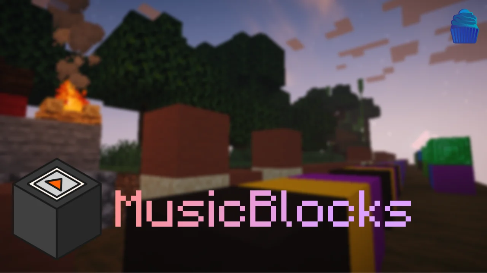

# MusicBlocks: Blocks as Notes (MC Datapack)

This datapack experiment makes blocks be able to play notes and simulate NoteBlocks without using any Repeaters (WIP, MAY CONTAIN BUGS).



## Installation

> **Please do never use this datapack in your world and use it on a new world or make a backup first, a lot of features modify the world and because this features may not be stable and could cause some extreme lags or change blocks, they might break your world (use at your own risk).**

You can grab the latest release of the datapack from [here](https://github.com/kadmuffin/mblock-datapack/releases).

### Loading NBS Files

The python script requires click and pynbs, you can install this dependencies by running.

```python
pip -r requirements.txt
```

Then you will be ready to parse your .nbs (Open NoteBlock Studio) file:

```python
python parse_nbs.py --input_file FILE_HERE
```
