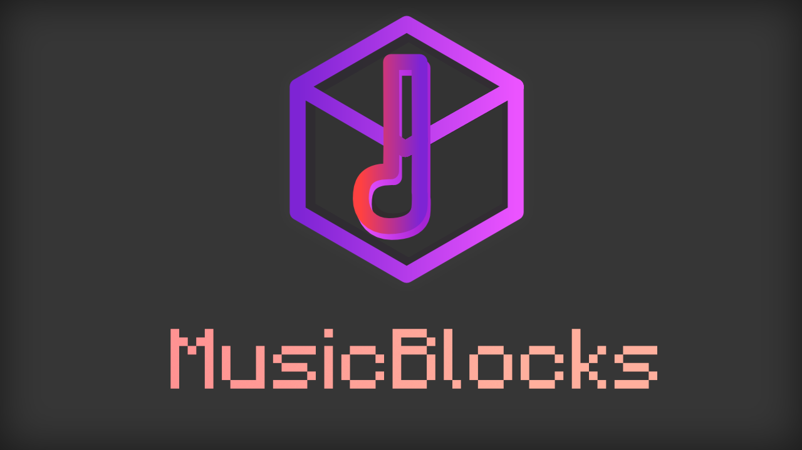

# MusicBlocks: Blocks as Notes (MC Datapack)

This datapack experiment makes blocks be able to play notes and simulate NoteBlocks without using any Repeaters (WIP, MAY CONTAIN BUGS).



## Warning (Disclaimer)

**Please do never use this datapack in your world and use it on a new world or make a backup first, a lot of features modify the world and because this features may not be stable and could cause some extreme lags or change blocks, they might break your world (use at your own risk).**

## Installation

You can grab the latest release of the datapack from [here](https://github.com/kadmuffin/mblock-datapack/releases).

## How to Use

To start using the datapack first you have to create the MusicBlock Player!, Get an item frame and place it on top of a `note_block`, then place an arrow on the item frame.

### How to get all notes

You can access all block notes by getting a structure block and loading the structure `mblock:notes_platform`, the more simple structure is named `mblock:notes`.

### How to get the NoteWand

A Tool included to manage the music blocks is the NoteWand, you can obtain it by throwing a carrot on a stick on top of the MusicBlock Player or running `function mblock:objects/note_wand/get_wand`.

### Change area settings

While holding the NoteWand, `Shift` + `Right-Click` on the MusicBlock Player, you will see on your chat a menu to manage this block.

Features like Overwrite Protection and Direction Protection aren't available yet, other settings should work mostly fine.

**If you want to expand your area in the X (Length) or the Y (Height) axis, take in account that it will generate a performance hit, so for basic testing or usage don't use big areas**, This area will cause a lot of lag when the blocks need to play as the code on the master branch generates is pretty slow.

### How to save and load songs

Throw a book on top of the music player block to save your song with its settings, throw the generated book on to the music block player to load data.

If you want to create your own app or code that parses songs, you can check the Item Format [here](https://github.com/kadmuffin/mblock-datapack/blob/master/mblock/data/mblock/functions/objects/item_reader/README.md).

### Loading NBS Files

Yes while the song you want to load is not too complex, the python script should do the work (expect some errors on parsed songs).

The python script requires click and pynbs, you can install this dependencies by running.

```python
pip -r requirements.txt
```

Then you will be ready to parse your .nbs (Open NoteBlock Studio) file:

```python
python parse_nbs.py --datapack true FILE_HERE
```
